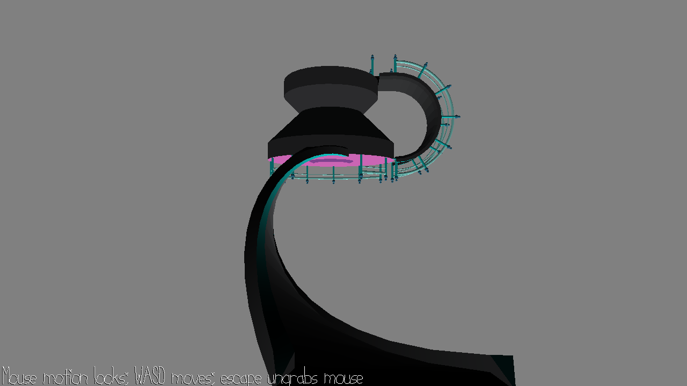

# Basic Implementation of Walk Mesh

Author: Harrison Chen

Design: This is a basic implementation of walk mesh. Due to some time conflicts, no game is made this time.

Screen Shot:

How To Play:

Mouse move view, WASD move position.

Sources: 
- original scene from base code

This game was built with [NEST](NEST.md).

